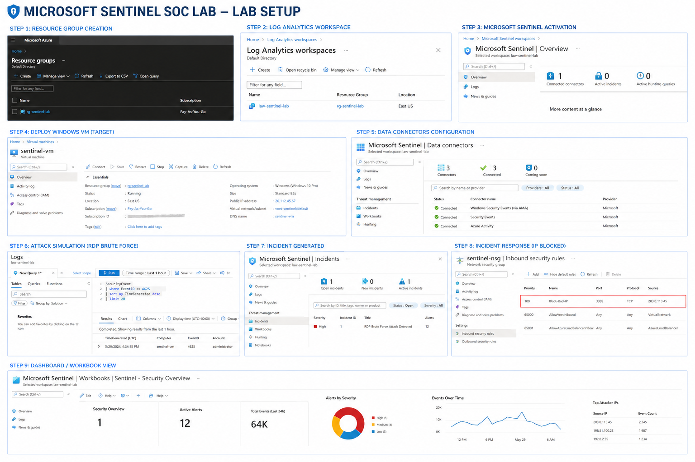

# 🔐 Microsoft Sentinel SOC Lab (End-to-End SIEM Project)



---

## 📌 Project Summary
This project demonstrates a **real-world Security Operations Center (SOC) implementation** using Microsoft Sentinel.  
It covers the complete lifecycle of **log ingestion → detection → investigation → response** by simulating a real cyber attack (RDP brute force).

This lab reflects practical skills required for **SOC Analyst / Cybersecurity Fresher roles**.

---

## 🎯 Objectives
- Build a cloud-based SIEM using Microsoft Sentinel  
- Collect and analyze security logs  
- Detect suspicious activities using KQL  
- Generate alerts and incidents  
- Perform basic incident response  

---

## 🏗️ Architecture Overview

### 🔄 Flow:
Attacker → Internet → Azure VM → Log Analytics → Microsoft Sentinel → Alert → Incident → Response

---

## ⚙️ Lab Environment

| Component | Details |
|----------|--------|
| Cloud Platform | Microsoft Azure |
| SIEM Tool | Microsoft Sentinel |
| Log Storage | Log Analytics Workspace |
| Target System | Windows Virtual Machine |
| Attack Type | RDP Brute Force |
| Language Used | KQL (Kusto Query Language) |

---

## 🧪 Lab Setup (Step-by-Step)

### 1️⃣ Resource Group Creation
- Created a dedicated resource group to manage lab resources  

---

### 2️⃣ Log Analytics Workspace
- Centralized log storage configured  

---

### 3️⃣ Microsoft Sentinel Enablement
- Connected Sentinel with Log Analytics Workspace  

---

### 4️⃣ Virtual Machine Deployment
- Windows VM deployed as attack target  
- RDP (Port 3389) enabled
  
---

### 5️⃣ Data Connectors Configuration
- Enabled:
  - Security Events
  - Windows Security Events
  - Azure Activity Logs  

---

## ⚔️ Attack Simulation

### 🔴 RDP Brute Force Attack
- Multiple failed login attempts generated  
- Logs collected in Sentinel  

---

## 🔍 Detection Using KQL

### 🚨 Failed Login Detection
```kql
SecurityEvent
| where EventID == 4625
| summarize Attempts = count() by Account, IPAddress
| order by Attempts desc


✅ Successful Login Monitoring
SecurityEvent
| where EventID == 4624
🚨 Incident Creation
Analytics rule created for brute-force detection
Incident triggered automatically


🛡️ Incident Response

Actions taken:

Investigated logs
Identified attacker IP
Blocked malicious IP using NSG

📸


📊 Dashboard & Visualization
Created workbook dashboard
Monitored login trends & attack patterns

📸


🧠 Key Skills Demonstrated
SIEM Deployment (Microsoft Sentinel)
Log Analysis & Threat Detection
KQL Query Writing
Incident Investigation
Basic Threat Hunting
Cloud Security Fundamentals
💼 Real-World Relevance

This project simulates tasks performed by:

SOC Analyst (L1)
Security Analyst
Cloud Security Associate
📈 Future Enhancements
🔁 Automate response using Logic Apps (SOAR)
🌐 Integrate Threat Intelligence feeds
🧠 Advanced threat hunting queries
📡 Monitor multiple VMs


👨‍💻 Author

Nitesh Vishwakarma
Cybersecurity Enthusiast | SOC Analyst Aspirant
